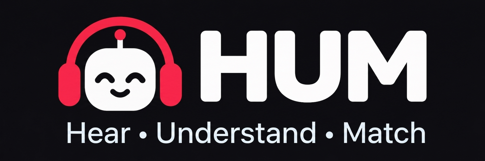

<div align="center">




A model that scores how well generated audio matches its text prompt, built to stay accurate on audio from generators it has never heard.

[Project site](https://aliai11.github.io/HUM/) · [Proposal](reports/proposal.pdf) · [XACLE 2027](https://xacle.org/2027/)


</div>

## Why this exists

New text to audio models appear every month. Judging them still takes human listeners. Models like AudioLDM and Tango can turn a sentence into sound, but checking whether the sound actually matches the sentence still requires slow, costly listening tests. The usual automatic score, CLAPScore, agrees with people only weakly.

[XACLE 2027](https://xacle.org/2027/) asks for a model that predicts the average human rating, from 0 to 10, of how well a clip matches its prompt. This year's test audio comes from generation systems that never appear in training.

## How HUM works

| Step | What | How |
| --- | --- | --- |
| **Hear** | Frozen Qwen2.5-Omni and M2D-CLAP encoders | Turn the clip and prompt into features, cached once. |
| **Understand** | Qwen2.5-Omni tuned with QLoRA | Answer a simple question: does this clip contain the sounds the prompt describes? |
| **Match** | Gating network + ordinal score head | Combine the verifier with CLAP similarity and predict the 0 to 10 rating. |

```mermaid
flowchart LR
  A[Audio + prompt] --> B[Hear]
  B --> C[Understand]
  B --> D[Match]
  C --> D
  D --> E[0 to 10 score]
